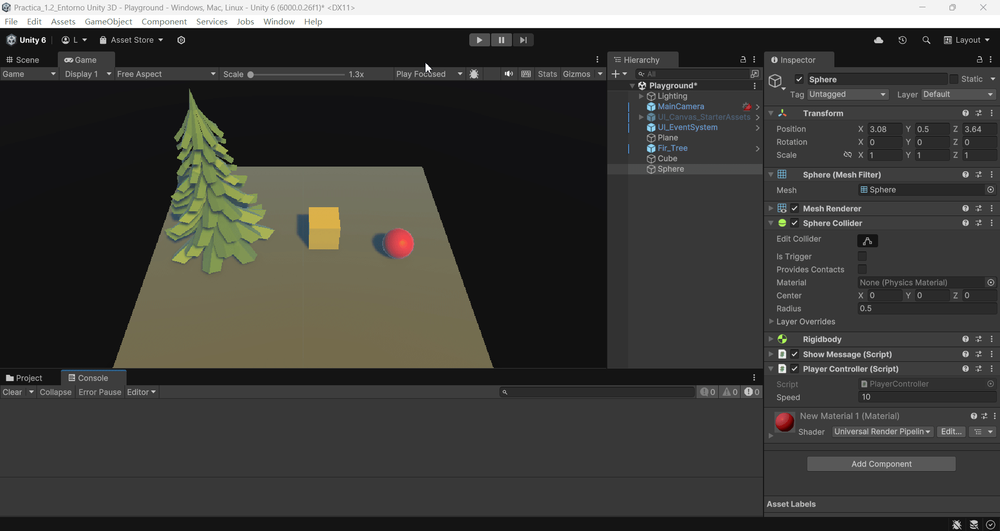

# FDV_1.2


```
>>  PRACTICA:   Unity Project 1.2 Entorno Unity 3D
>>  COMPONENTE: XueMei Lin
>>  GITHUB:     https://github.com/XueMei-L/FDV_1.2.git
```

# Proceso de la practica 1.2
### Paso1. Cargar la escena de Third Person
En el [AssetStore](https://assetstore.unity.com/) se puede encontrar [Starter Assets - ThirdPerson](https://assetstore.unity.com/packages/essentials/starter-assets-thirdperson-updates-in-new-charactercontroller-pa-196526), se puede abrir con Unity.
Importa el paquete y cargar la escena:


### Paso2. Conversar de la escena el personaje y elimina el entorno
Eliminamos el entorno a traves del GameObject [Enviroment]


### Paso3. Incluye GameObjects del menú
Se agrega un plano, un cubo y una esfera


### Paso4. Incluye GameObjects de la Assets Store
Utilizamos un personaje que encontramos en el [Asset Store](https://assetstore.unity.com/):
[Free Trees](https://assetstore.unity.com/packages/3d/vegetation/trees/free-trees-103208)
Hay que descargar y importar.


### Paso 5. Convierte uno de los GameObjects incluido en el personaje
ocultamos el personaje, y le añadimos (en mi caso es el cubo que quiero convertir en el personaje), los componentes necesarios como:
***PlayerController Script***
***Rigibody***


### Paso 6. Agregar una fuente de iluminación y configurarla con luz de algún color distinto del blanco
Mediante el cambio de **color** en el GameObject **Lighting**, se puede elegir cualquier color de iluminacion.


### Paso 7. Generar un script que muestre en consola un mensaje
Script ***HelloUnity***:
```
using UnityEngine;

public class ShowMessage : MonoBehaviour
{
    // Start is called before the first frame update
    void Start()
    {
        // Show message in the console
        Debug.Log("Hello Unity");
    }
}
```


**Resultado final**:

